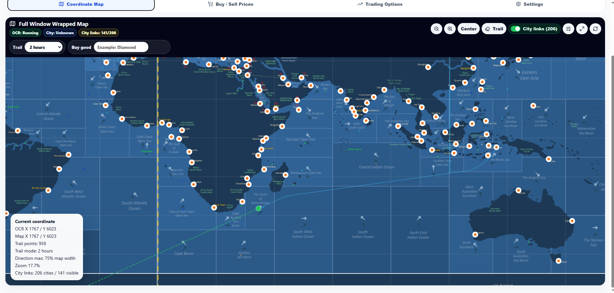
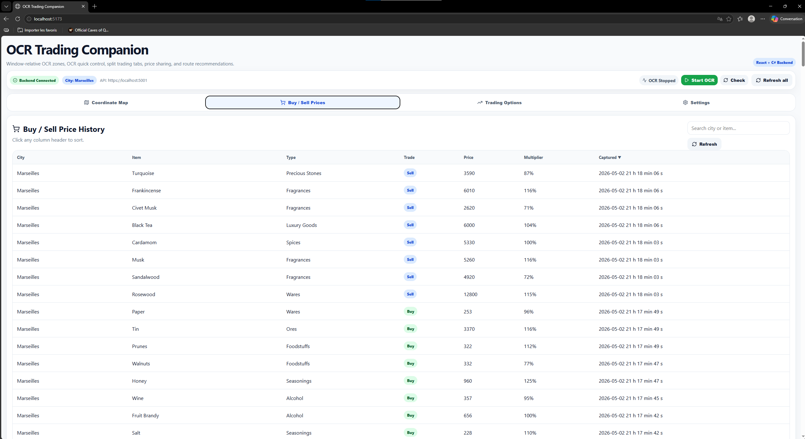
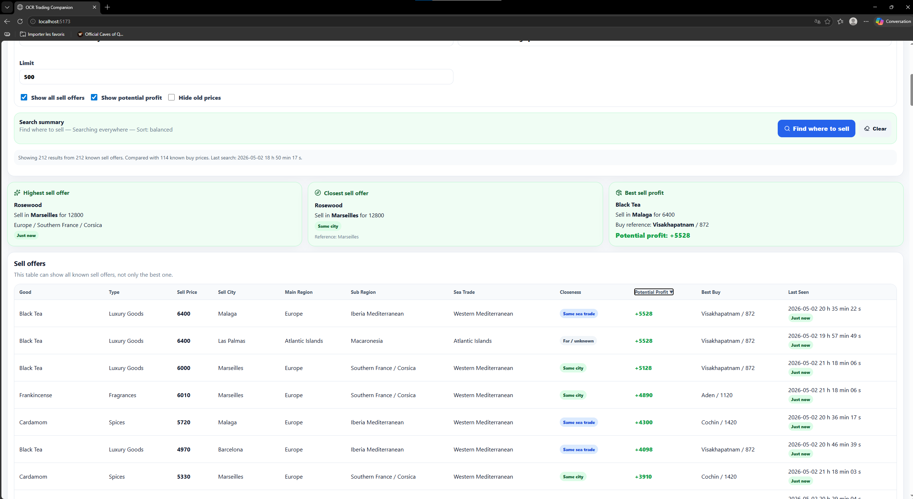
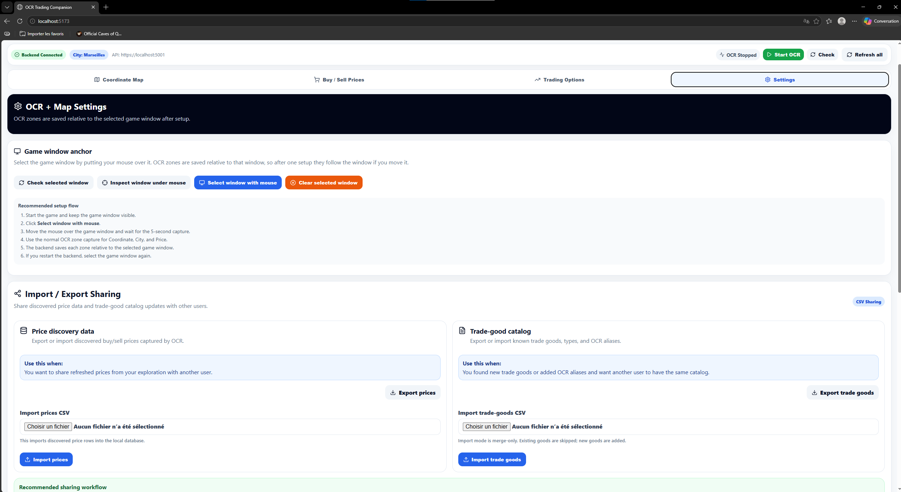

# OCR Trading Companion Frontend
## Uncharted Water Online tool

React/Vite frontend for the OCR Trading Companion app.

This app connects to the OCR Trading Backend and gives the user a visual interface for OCR setup, map tracking, price history, trade-good discovery, route recommendations, and data sharing.

---

## Screenshots

### Coordinate Map



### Buy / Sell Price History



### Trading Options



### Settings Page



---

## What this app does

OCR Trading Companion helps players collect and use trading information from the game screen.

The frontend lets the user:

- connect to the OCR backend
- select the game window
- configure OCR boxes
- start and stop OCR
- view detected city and coordinates
- track position on a map
- view buy/sell price history
- find where to buy or sell trade goods
- find profitable trade routes
- add missing trade goods
- review unknown OCR-detected goods
- import/export price data
- import/export trade-good catalog data

---

## Main tabs

### Coordinate Map

Shows the latest OCR coordinates and recent coordinate history on the world map.

Useful for:

- checking if coordinate OCR is working
- seeing current map position
- validating world/map settings


---

### Buy / Sell Prices

Shows all captured trade prices.

The user can search and sort by:

- city
- item
- trade-good type
- buy/sell type
- price
- multiplier
- captured time


---

### Trading Options

Trading Options includes tools for finding goods and routes.


#### Find trade goods

Helps the user find where to buy or sell a trade good.

The user can switch between:

- **Find where to buy**
- **Find where to sell**

Search options include:

- good name
- good type
- selected main regions
- closest to current OCR city
- closest to selected city
- cheapest/highest price
- closest result
- balanced result
- best potential profit
- show all offers or only the best offer per good
- hide old prices

#### Deal helper

Helps the user find profitable trade routes.

Simple mode lets the user:

- select one or more main regions
- choose trade style
- find the best single-good route
- find the best multi-good route

Advanced mode lets the user control:

- item name
- item type
- buy regions
- sell regions
- minimum profit
- multi-good rules
- result limits

#### Other

Used for trade-good catalog management.

The user can:

- manually add a missing trade good
- set name, type, and aliases
- check similar existing goods
- accept OCR-detected unknown goods
- dismiss bad OCR candidates
- browse the current trade-good catalog

Aliases are useful for OCR mistakes.

Example:

```text
Diamond|Diamoncl|Dlamond
```

---

### Settings

The Settings tab is where the user configures OCR and sharing.


The user can:

- select the game window
- configure OCR boxes
- configure map/world settings
- configure OCR timing
- import/export price data
- import/export trade-good catalog data

---

## OCR setup guide

The most important setup step is selecting the correct OCR boxes.

Each OCR box should include only the text that belongs to that box. If the box is too large, OCR may read extra text and parse the wrong value. If the box is too small, OCR may miss part of the text.

---

### Step 1 — Select the game window

Go to:

```text
Settings → Game Window
```

Use the game window selection tool.

The backend saves OCR boxes relative to the selected game window. This helps OCR keep working even if the game window moves.

Then open the OCR calibration screen and click:

```text
Capture screen / game window
```

Use the screenshot to drag and resize each selected box. Click **Test selected box OCR** to check each box, then click **Save layout** when all boxes look correct.

---

### Step 2 — Set the Coordinate box

The Coordinate box should cover only the coordinate text.

Example:


Use this box for the part of the screen where the game shows the current X/Y position.

Recommended:

- include the full coordinate text
- avoid nearby icons or unrelated text
- keep the box tight but not too tight
- test the selected box before saving
- start OCR and check the Coordinate Map after saving

In OCR calibration, use:

```text
Selected box → Coordinate
```

---

### Step 3 — Set the City region box

The City region box should cover only the current city/location name.

Example:


Use this box for the part of the screen where the game shows the current city.

Recommended:

- include only the city name
- avoid nearby UI text
- avoid big decorative UI elements
- test by checking the city badge at the top of the app

In OCR calibration, use:

```text
Selected box → City region
```

The city detected by OCR is shown in the app status bar:

```text
City: Alexandria
```

---

### Step 4 — Set the row-selection boxes

The row-selection boxes should cover the visible trade-good rows.

Example:


Use these boxes for the rows that contain trade-good names and prices.

Recommended:

- cover one full row at a time
- include item name, price, and multiplier area
- avoid buttons, tabs, headers, and unrelated text
- use **Advanced row setup** only if you need more or fewer visible rows
- test one row before applying the same shape to other rows

In OCR calibration, use:

```text
Selected box → Row 1 whole row
```

Then adjust the other row boxes if needed.

---

### Step 5 — Set the Buy region box

The Buy region box should cover only the game text or marker that proves the trade screen is in Buy mode.

Example:


Recommended:

- include only the Buy label/marker
- avoid Sell text or nearby buttons
- keep the box small and focused
- test the selected box before saving

In OCR calibration, use:

```text
Selected box → Buy region
```

---

### Step 6 — Set the Sell region box

The Sell region box should cover only the game text or marker that proves the trade screen is in Sell mode.

Example:


Recommended:

- include only the Sell label/marker
- avoid Buy text or nearby buttons
- keep the box small and focused
- test the selected box before saving

In OCR calibration, use:

```text
Selected box → Sell region
```

After all boxes are set, save the layout, start OCR, and open the game's trade screen. Captured prices should appear in:

```text
Buy / Sell Prices
```

The OCR boxes are used together to detect:

- trade-good name
- price
- multiplier
- buy/sell type

---

## Backend requirement

This frontend expects the OCR Trading Backend to be running.

Default backend URL:

```text
https://localhost:5001
```

The backend also exposes HTTP on:

```text
http://localhost:5000
```

The frontend uses HTTPS by default.

---

## Requirements

Install these before running the frontend:

- Node.js 18 or newer
- npm
- OCR Trading Backend running locally

Check your versions:

```bash
node --version
npm --version
```

---

## Install

Clone or open the frontend repo, then run:

```bash
npm install
```

---

## Run in development mode

```bash
npm run dev
```

Vite usually starts on:

```text
http://localhost:5173
```

Open that URL in your browser.

---

## Configure backend URL

By default, the frontend uses:

```text
https://localhost:5001
```

To override it, create a `.env` file in the frontend root:

```text
VITE_API_BASE_URL=https://localhost:5001
```

For HTTP backend testing:

```text
VITE_API_BASE_URL=http://localhost:5000
```

Restart the Vite dev server after changing `.env`.

---

## Recommended startup order

1. Start the backend.

2. Confirm backend health works:

   ```text
   https://localhost:5001/api/health
   ```

3. Start the frontend:

   ```bash
   npm run dev
   ```

4. Open:

   ```text
   http://localhost:5173
   ```

5. Go to Settings.

6. Select the game window.

7. Configure OCR boxes:

   - Coordinate
   - City region
   - Row selection
   - Buy region
   - Sell region

8. Start OCR.

---

## Import / Export sharing

The Settings tab includes sharing tools.

Users can export and import:

- discovered price data
- trade-good catalog data

This is useful when one user has explored and refreshed prices, or discovered new trade goods, and wants to share that data with another user.

### Price data

Exported file:

```text
prices.csv
```

Use this to share captured buy/sell prices.

### Trade-good catalog

Exported file:

```text
trade-goods.csv
```

Use this to share:

- new trade goods
- trade-good types
- OCR aliases

This helps other users avoid adding the same missing goods manually.

---

## Troubleshooting

### Backend shows offline

Check that the backend is running.

Open:

```text
https://localhost:5001/api/health
```

If the browser warns about the HTTPS certificate, trust the .NET development certificate from the backend machine:

```bash
dotnet dev-certs https --trust
```

Then restart the browser and backend.

---

### CORS error

The backend currently allows frontend development origins like:

```text
http://localhost:5173
http://localhost:5174
http://localhost:3000
```

Use one of those frontend ports, or update the backend CORS policy.

---

### OCR detects the wrong coordinate

Check the Coordinate box.

Common causes:

- box includes extra UI text
- box does not include the full coordinate
- game window was moved before saving relative boxes
- Windows scaling changed

Re-select the game window and save the Coordinate box again.

---

### OCR detects the wrong city

Check the City region box.

Common causes:

- box includes other nearby text
- city name is partially cut off
- city is missing from `Data/cities.csv`
- city needs an alias

---

### OCR detects wrong trade goods

Check the row-selection, Buy region, and Sell region boxes.

Common causes:

- row-selection box is too large
- row-selection box includes buttons or unrelated UI text
- Buy or Sell region box includes the wrong mode label
- item name is partially cut off
- trade good is missing from `Data/trade-goods.csv`
- OCR needs aliases for common mistakes

Go to:

```text
Trading Options → Other
```

Then add the missing trade good or accept an OCR-detected unknown good.

---

### New trade good does not show in the frontend

Refresh the catalog or reload the page.

If using the Other tab, the frontend should refresh the catalog after adding a good.

---

## Useful scripts

```bash
npm install
npm run dev
npm run build
npm run preview
```

---

## Project structure

```text
src/
  App.jsx
  api.js
  components/
    TradingTab.jsx
    TradingGoodLookupTab.jsx
    TradingDealAdvancedTab.jsx
    TradingOtherTab.jsx
    DataSharingPanel.jsx
    WrappedCoordinateMap.jsx
    SortableTable.jsx
    MultiSelectChips.jsx
  styles.css

public/
  maps/
    world-map.png

docs/
  images/
    PriceHistory.png
    SettingPage.png
    TradingPage.png
    OCR Buy setup.png
    OCR City name setup.png
    OCR Coordinate setup.png
    OCR Row Selection setup.png
    OCR Sell setup.png
```

---

## Notes for future improvements

Good future frontend improvements:

- add real distance calculation if city coordinates are added
- add route distance/time estimates
- add favorite goods
- add favorite routes
- add price freshness filters by exact hours
- add import/export preview before applying data
- add confirmation before accepting unknown OCR goods
- add edit/delete support for existing trade goods
- add backup download before importing CSV files
